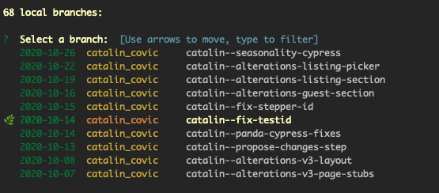

# b
Git branch tools + shortcuts. This tool was created for own personal workflow - your mileage may vary, use at own risk.

## Usage

#### `b`
View available branches to checkout
 

#### `b -l`
View local branches in repo
 

#### `b prune`
Select branches to delete
 

#### `b prune 20`
Select branches to delete that are older than n days
 

#### `b clone`
Clone branch - useful if about to make potentially destructive changes and don't wanna go through reflog to fix it
 

#### `b add`
Walk through changed + untracked files to stage, basically a glorified git diff with the option to add, skip or checkout unstaged files
 

## Dev
- install deps via `go mod download`
- build and run `go build && ./b`
